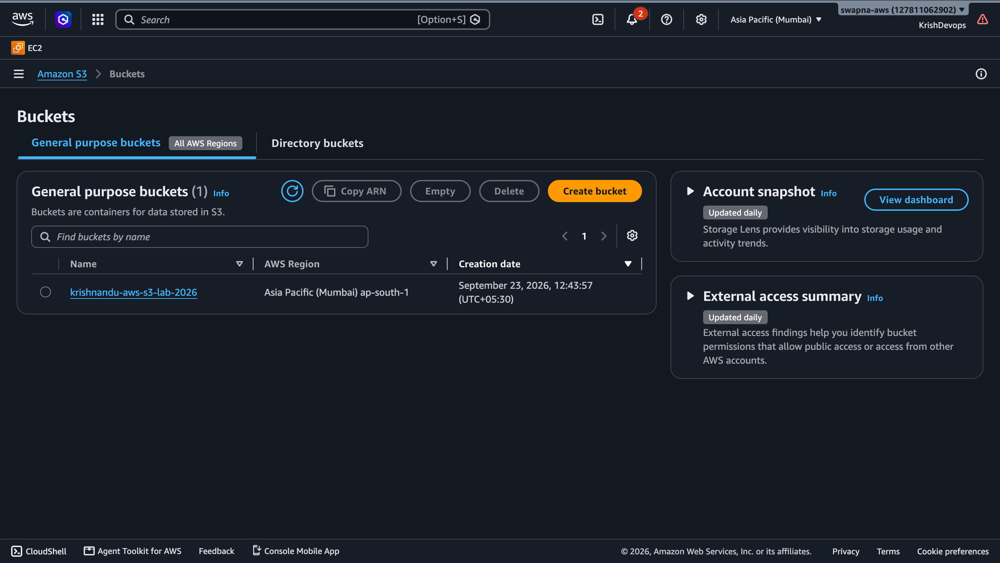
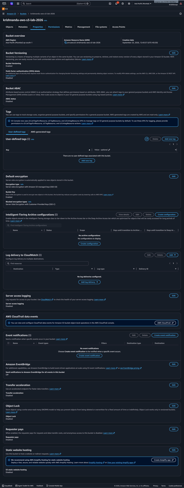
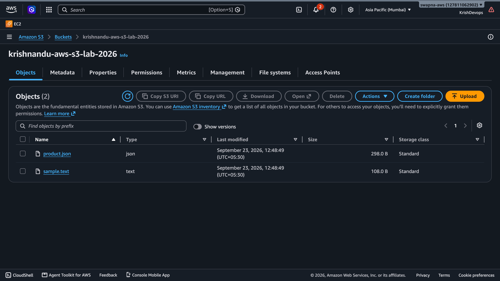
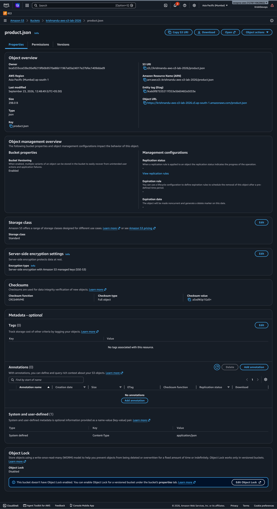
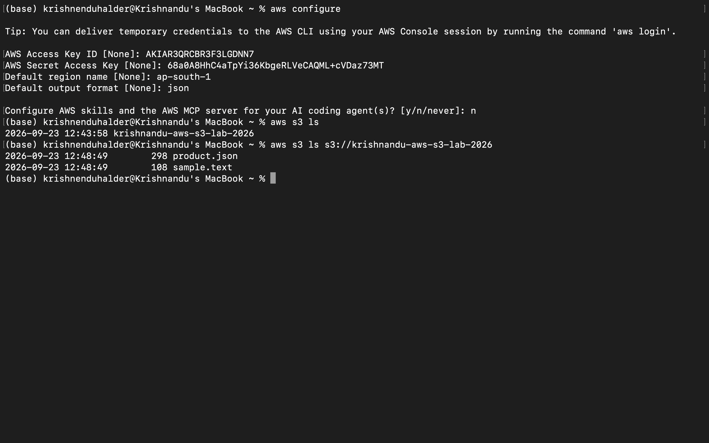
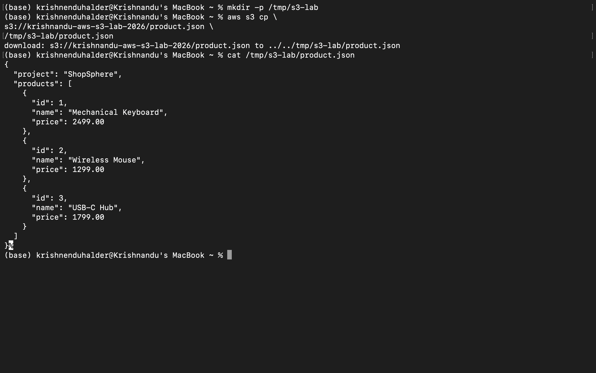
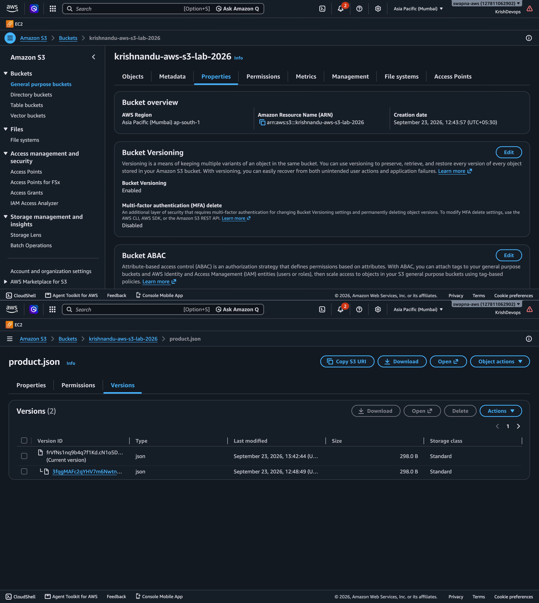

# AWS S3 Hands-On Lab

## Objective

Learn the fundamentals of Amazon S3 by creating a private
S3 bucket, uploading and downloading objects, using the AWS CLI,
and testing object versioning.

---

## Architecture

```text
Local Mac
   |
   | AWS Console / AWS CLI
   |
   v
Amazon S3
   |
   └── Bucket
       ├── products.json
       └── sample.txt
```

## AWS Service

- Amazon S3

## Region

- ap-south-1 (Mumbai)
## Hands-On Tasks

- [x] Created an S3 bucket
- [x] Selected Mumbai region
- [x] Kept Block Public Access enabled
- [x] Enabled bucket versioning
- [x] Uploaded JSON object
- [x] Uploaded text object
- [x] Viewed object metadata
- [x] Downloaded object through AWS Console
- [x] Listed bucket contents using AWS CLI
- [x] Downloaded object using AWS CLI
- [x] Tested object versioning

## Bucket Security

Block Public Access was kept enabled.

The bucket was not configured as a public website or
public file repository.

## Objects

`products.json`

Contains sample ShopSphere product data.

`sample.txt`

Contains a simple text file used for S3 upload/download testing.

## AWS CLI Commands

List buckets:
```bash
aws s3 ls
```
List objects:
```bash
aws s3 ls s3://YOUR-BUCKET-NAME
```
Download an object:
```bash
aws s3 cp \
s3://YOUR-BUCKET-NAME/products.json \
/tmp/products.json
```
## Versioning

S3 bucket versioning was enabled.

The same ``products.json`` object was uploaded twice with
different content to demonstrate that S3 maintains multiple
object versions.

## Key Concepts Learned
### Bucket

A logical container for storing objects in Amazon S3.

### Object

A file and its associated metadata stored inside an S3 bucket.

### Object Key

The unique name/path used to identify an object within a bucket.

### Versioning

Allows multiple versions of an object to be retained.

### Block Public Access

Provides account/bucket-level controls that help prevent
accidental public access to S3 resources.

### Encryption

S3 supports server-side encryption for stored objects.

## Evidence
### S3 Bucket

### Bucket Properties

### Uploaded Objects

### Object Details

### AWS CLI

### CLI Download

### Versioning



---
