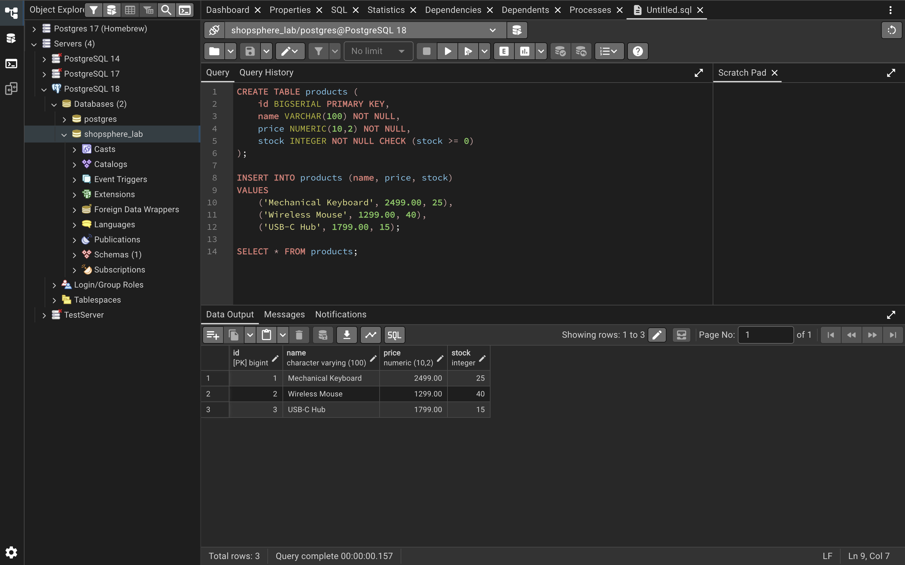
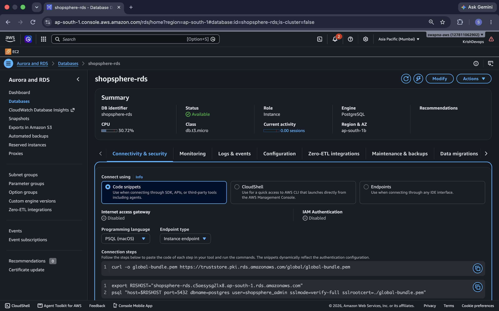
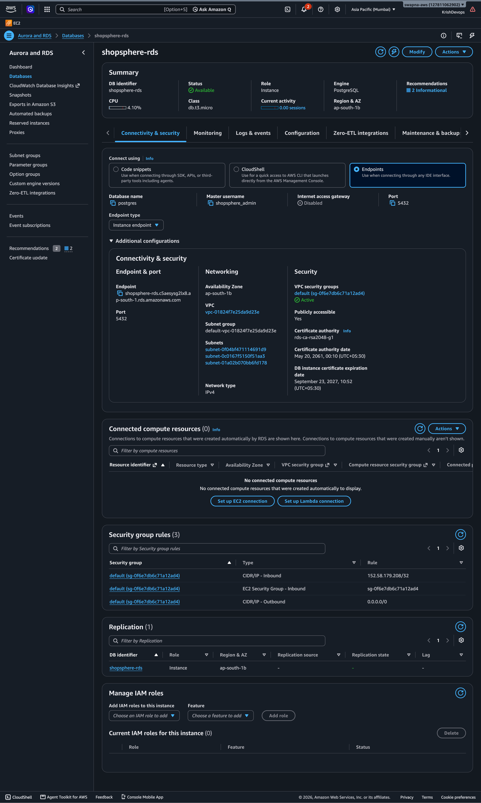
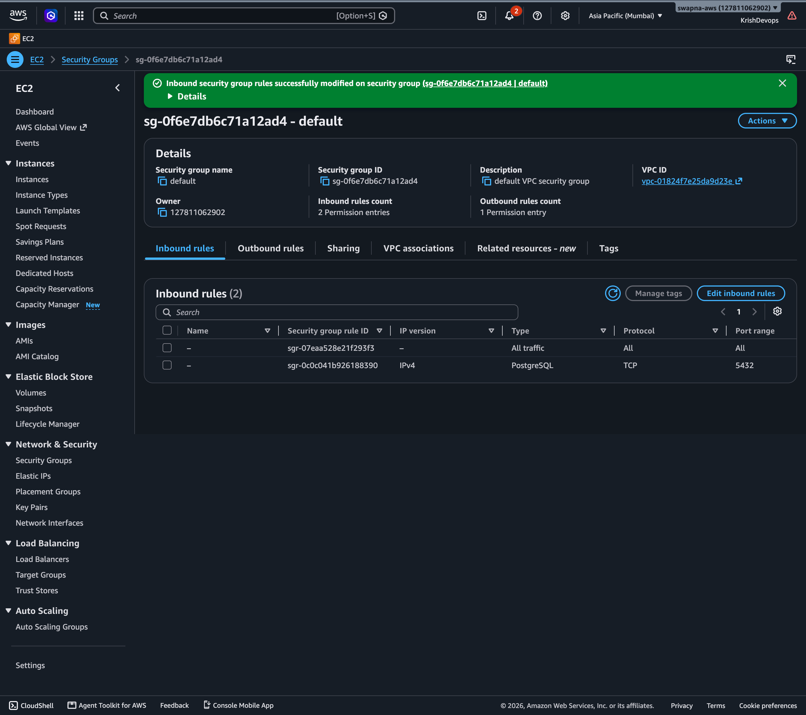
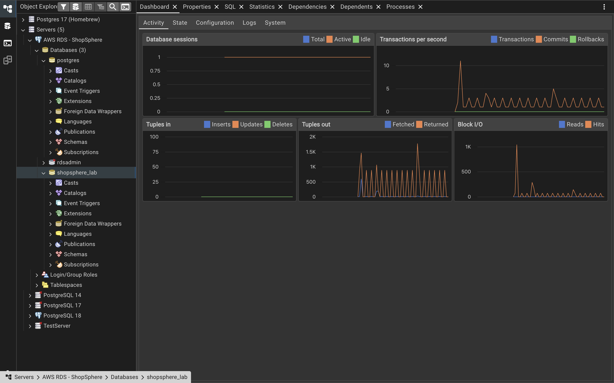
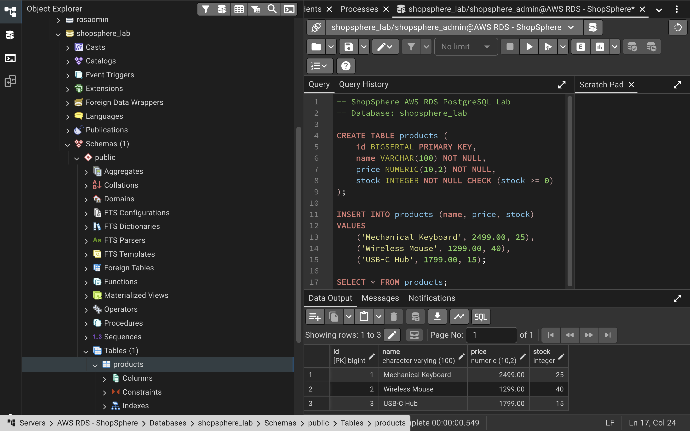
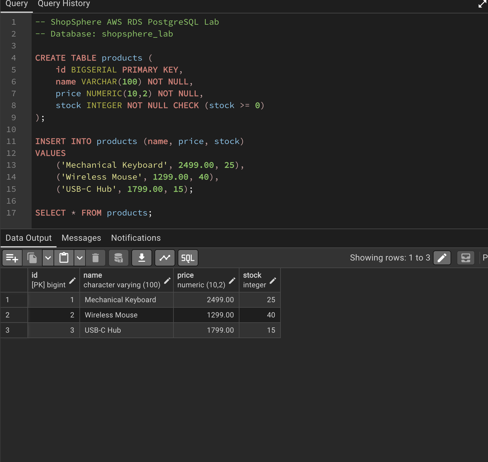
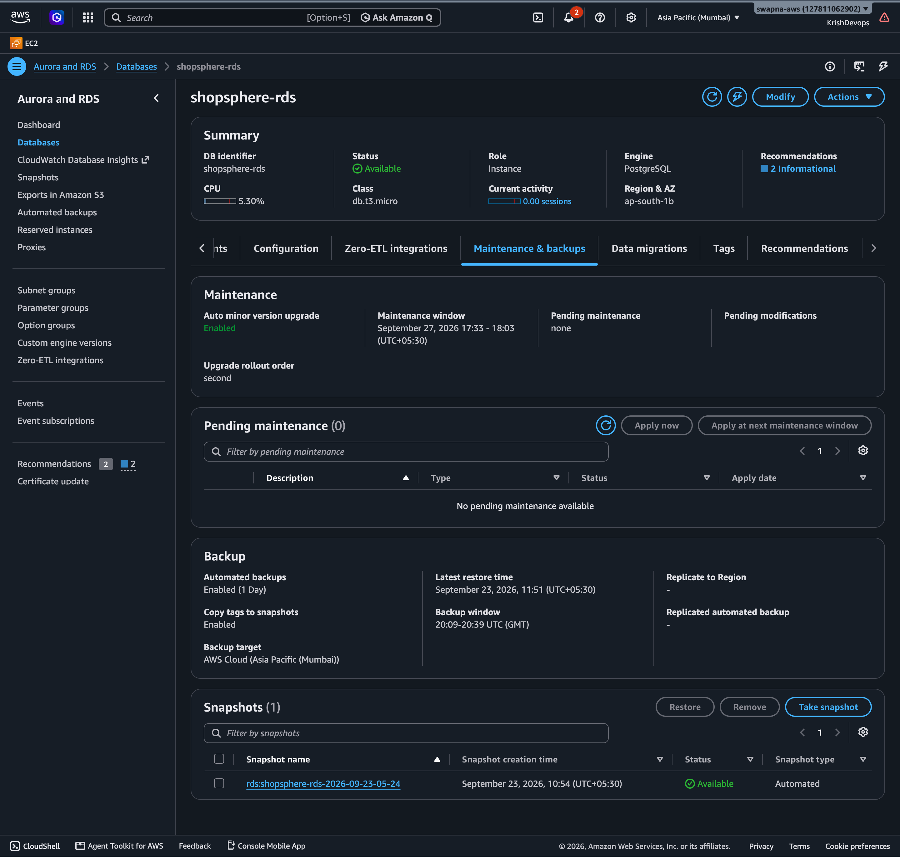

# AWS RDS PostgreSQL Hands-On Lab

## Objective

Deploy PostgreSQL using Amazon RDS and connect to the
managed database using pgAdmin 4.

The lab demonstrates the basic workflow of moving a
PostgreSQL database from a local environment to a managed
AWS database service.

---

## Architecture

Engine: PostgreSQL
Deployment: Single-AZ
Database: shopsphere_lab
Port: 5432
Region: ap-south-1

```text
Local Mac
   |
   | pgAdmin 4
   |
   | TCP 5432
   v
Security Group
   |
   v
Amazon RDS PostgreSQL
   |
   v
shopsphere_lab
   |
   v
products table
```

## Objective

Deploy PostgreSQL using Amazon RDS and connect to
the managed database from a PostgreSQL client.


## Services

- Amazon RDS
- PostgreSQL
- Amazon VPC
- Security Groups

## Hands-On Tasks

- [x] Created PostgreSQL database locally
- [x] Created PostgreSQL schema
- [x] Created Amazon RDS PostgreSQL instance
- [x] Configured database credentials
- [x] Configured security group
- [x] Restricted PostgreSQL access to my IP
- [x] Retrieved RDS endpoint
- [x] Connected to RDS using pgAdmin 4
- [x] Created database on RDS
- [x] Created tables on RDS
- [x] Inserted test data
- [x] Queried data from RDS
- [x] Reviewed automated backup configuration
- [x] Studied Multi-AZ architecture
- [x] Compared RDS with PostgreSQL on EC2

## Database Schema

The database contains the following table:

products

| Column | Type          | Constraint     |
| ------ | ------------- | -------------- |
| id     | BIGSERIAL     | Primary Key    |
| name   | VARCHAR(100)  | NOT NULL       |
| price  | NUMERIC(10,2) | NOT NULL       |
| stock  | INTEGER       | NOT NULL, >= 0 |

The schema is available in:

- schema.sql

## Security

The RDS security group was configured to allow
PostgreSQL traffic on port 5432 only from the
client's current IP address.

No database credentials are stored in this repository.

## Backups

Amazon RDS automated backup configuration was reviewed
through the RDS console.

Backup and point-in-time recovery capabilities were studied
as part of this lab.

## Evidence

### Local Instance



### RDS Instance



### RDS Connectivity



### Security Group



### PostgreSQL Connection



### RDS Tables



### Query Result



### Backup Configuration




### Multi-AZ

Multi-AZ is an availability configuration where Amazon RDS
maintains a standby database in another Availability Zone
for failover.

This lab uses a Single-AZ configuration to keep the learning
environment simple and cost-conscious.

Multi-AZ was studied as a concept but was not enabled for
this lab.

## RDS vs PostgreSQL on EC2

| Feature             | Amazon RDS                          |  PostgreSQL on EC2  |
|---------------------|-------------------------------------|---------------------|
| Database management | AWS managed service                 | Self-managed        |
| OS management       | AWS responsibility                  | User responsibility |
| Backups             | Built-in RDS features               | Configure manually  |
| Patching            | Managed by AWS within service model | User manages        |
| Scaling             | RDS capabilities                    | User manages        |
| Control             | Less infrastructure control         | More control        |
| Operational effort  | Lower                               | Higher              |