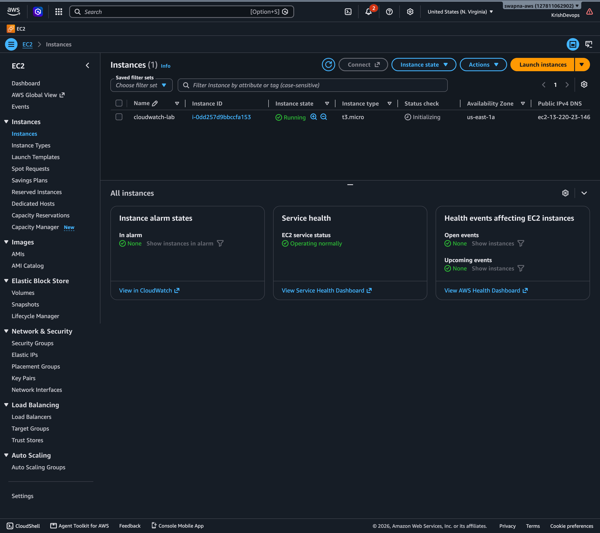
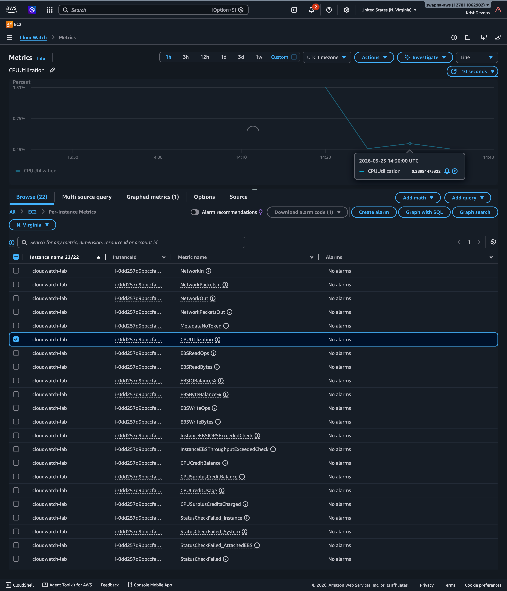
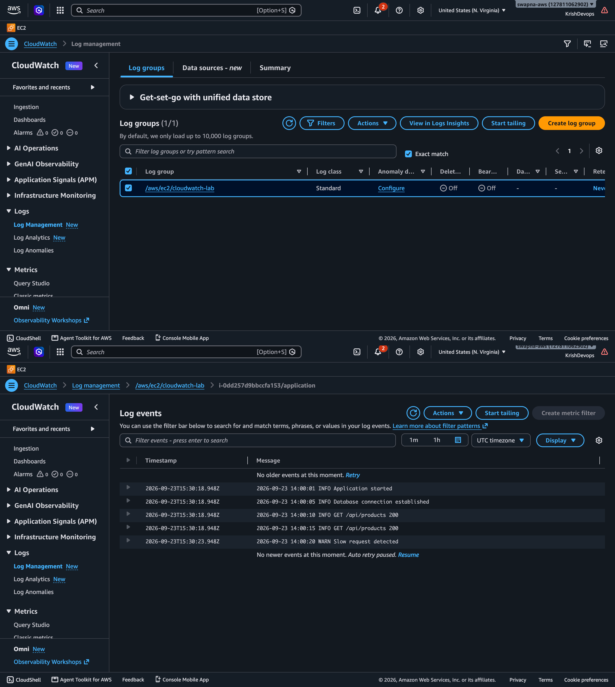
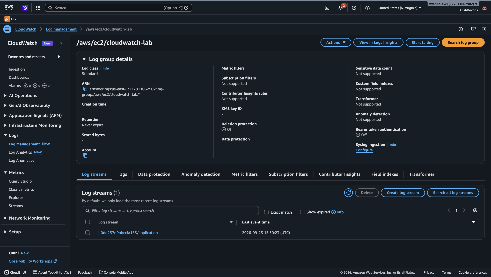
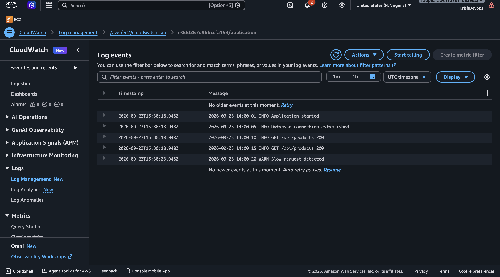
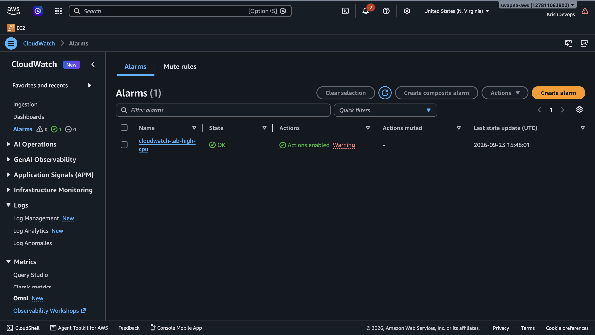
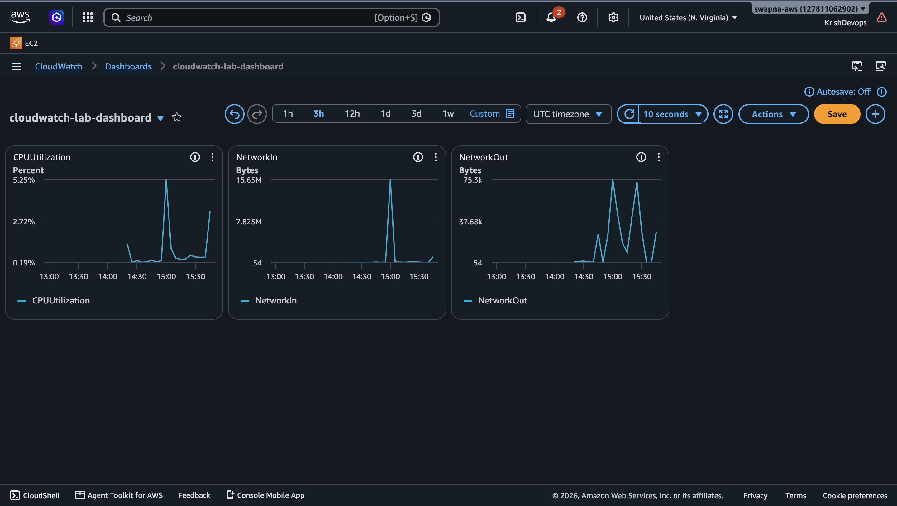

# AWS CloudWatch Hands-On Lab

## Objective

Learn how AWS CloudWatch can be used to monitor EC2
infrastructure and collect application logs.

---

## Architecture

```text
                    AWS
                     |
                     v
                    EC2
              ┌──────┴──────┐
              │             │
           Metrics       Application
              │             │
              v             v
         CloudWatch     Log File
              │             │
              │       CloudWatch Agent
              │             │
              └──────┬──────┘
                     v
                CloudWatch
             ┌────┬────┬────┐
             │    │    │    │
           Logs Alarm Dashboard
```
## AWS Services
- Amazon EC2
- Amazon CloudWatch
- IAM
- CloudWatch Agent
## Hands-On Tasks
- [x] Created EC2 instance
- [x] Viewed EC2 CPU metrics in CloudWatch
- [x] Installed/configured CloudWatch Agent
- [x] Created CloudWatch Log Group
- [x] Created CloudWatch Log Stream
- [x] Collected application logs from EC2
- [x] Viewed application log events
- [x] Created CloudWatch CPU alarm
- [x] Tested alarm state transition
- [x] Created CloudWatch dashboard
## EC2 Monitoring

EC2 provides basic monitoring metrics to CloudWatch.

The lab used the following metric:

``CPUUtilization``

Additional EC2 metrics can be used for monitoring network
and instance activity.

## CloudWatch Logs

The CloudWatch Agent was configured to collect:

```/home/ec2-user/cloudwatch-app/app.log```

The logs were sent to:

`/aws/ec2/cloudwatch-lab`

## Log Group

A Log Group provides a logical container for related log
streams.

Example:   `/aws/ec2/cloudwatch-lab`

## Log Stream

The Log Stream contains log events from a particular source.

Example:

``<instance-id>/application``

## Application Logs

Example application events:

``` bash 
INFO Application started
INFO Database connection established
INFO GET /api/products 200
WARN Slow request detected 
```

These logs were generated on EC2 and collected by the
CloudWatch Agent.

## Alarms

A CloudWatch alarm was created using the EC2
CPUUtilization metric.

The alarm demonstrates the transition between:
```` bash
OK
 ↓
ALARM

````
based on the configured CPU threshold.

The threshold used in this lab is only for demonstrating
CloudWatch alarm functionality and is not a production
monitoring recommendation.

## Dashboard

A CloudWatch dashboard was created to visualize EC2
monitoring metrics.

## IAM

The EC2 instance uses an IAM role to provide the permissions
required by the CloudWatch Agent.

AWS credentials were not hard-coded into the application
or stored in this repository.

## Key Concepts Learned

### CloudWatch

AWS monitoring and observability service.

### Metrics

Numerical measurements collected over time.

Examples:
```
CPUUtilization
NetworkIn
NetworkOut
```

### Log Group
Logical container for related CloudWatch log streams.

### Log Stream

Sequence of log events from a particular source.

### Alarm

Monitors a metric or condition and changes state when the
configured threshold is reached.

### Dashboard

Visual interface containing monitoring widgets and metrics.

### CloudWatch Agent

Agent installed on an EC2 instance to collect additional
system and application information and send it to CloudWatch.

## Evidence
### EC2 Instance

### CloudWatch Metrics

### Log Group

### Log Stream

### Application Logs

### Alarm

### Dashboard
